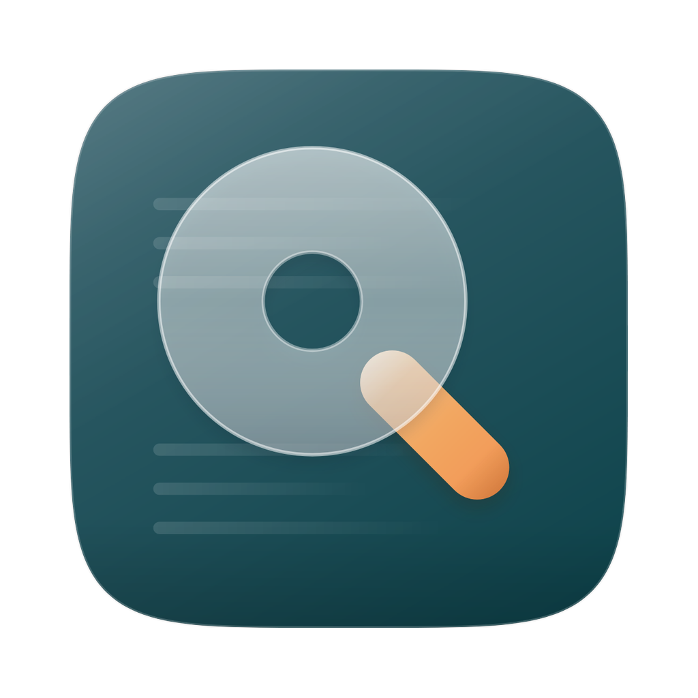

<div align="center">



# Looking Glass

**A local AI research companion for macOS.**
Native SwiftUI on the surface, a Python agent underneath, and everything runs on your own machine.

[](https://github.com/yogiee/LookingGlass/releases/latest)


</div>

---

Looking Glass is a chat app built around **Alice** — a research companion who's direct, curious, and actually in it with you, not a cheerful service desk. It talks to a local [Ollama](https://ollama.com) model, runs tools on your behalf, and keeps your conversations on disk where they belong. No cloud, no accounts, no telemetry.

It's a two-process app: a native SwiftUI window owns the experience, and a local Python sidecar owns the intelligence (the agent loop, tool execution, and inference calls). They talk over `localhost` via HTTP + server-sent events.

## Features

- **Streaming chat** with a frosted-glass UI — rail + collapsible sidebar, light/dark, Wonderland character avatars
- **Conversation history** that persists across launches (SQLite + full-text search), with **folder-bound Projects** alongside independent chats — rename, delete, search, organize
- **Built-in tools** — file read/write, shell, web search, HTTP, calculator, PDF extract, page reader, vision, memory, and a thinking scratchpad — run through a multi-turn agent loop with inline tool-call cards
- **Local image generation** — ask Alice for an image and she generates it on your own GPU (via the [OllamaMCP](https://github.com/yogiee/ollama-mcp) server), shown **inline** with a full-window viewer (zoom, pan, copy, reveal in Finder)
- **MCP server support** — plug in [Model Context Protocol](https://modelcontextprotocol.io) servers (image generation, memory banks, your own tools) from **Settings → MCP**; their tools appear to Alice automatically
- **Organized file saving** — images, documents, and downloads Alice creates land in tidy type-folders under a save location you choose (**Settings → System → Files**), or the project folder when you're in a Project
- **Per-chat model switching** — change the model for one chat from the input bar without touching your global default; cloud "specialist" models are an explicit, consent-gated tap
- **GitHub-flavored markdown** rendering — headings, blockquotes, tables, task lists, code blocks
- **Selectable chat font** — a sans for prose paired with a matching monospace for code (SF Pro, Inter, IBM Plex Sans, Roboto)
- **Configurable** — Ollama URL, per-tool toggles, MCP servers, save location, custom avatar, font size, line height, and Alice's system prompt, all in Settings
- **Auto-updates** via [Sparkle](https://sparkle-project.org)

## Requirements

- **macOS 26+ (Tahoe)** on **Apple Silicon**
- [Ollama](https://ollama.com) installed and running (`ollama serve` — the official app, not the Homebrew bottle)
- [Homebrew](https://brew.sh) Python 3.11+ (the app embeds its own venv but builds it from the Homebrew interpreter)

## Install

1. Install [Ollama](https://ollama.com) and make sure it's running.
2. Pull the models you want to use (see [Models](#models) below).
3. Download the latest `LookingGlass.dmg` from the [**Releases**](https://github.com/yogiee/LookingGlass/releases/latest) page, drag it to Applications, and launch.

The app starts and health-checks its sidecar automatically; updates arrive in-app via Sparkle. Models, MCP servers, and your save location are all configurable in **Settings**.

## Models

Looking Glass routes by role rather than using one model for everything. The chat (voice) model can be a small, characterful model that doesn't itself call tools — when a turn needs a tool, a separate **tool-capable "hands" model** runs it behind the scenes and the voice model presents the result. Configure roles in `sidecar/config.toml` (`[models]`) or pick per-chat in the app.

The current defaults:

| Role | Model | Pull |
|------|-------|------|
| Chat (voice) | `s80982708/ZINI-LOCAL:latest` | `ollama pull s80982708/ZINI-LOCAL:latest` |
| Tool-caller (hands) | `granite4.1:3b` | `ollama pull granite4.1:3b` |
| Work (code / research) | `gemma4:12b-mlx` | `ollama pull gemma4:12b-mlx` |
| Specialist (consult, cloud) | `gemma4:31b-cloud` | `ollama pull gemma4:31b-cloud` |
| Deep research (cloud) | `gpt-oss:120b-cloud` | `ollama pull gpt-oss:120b-cloud` |

Use any chat-capable model you like — anything installed shows up in the picker. If the configured model isn't installed, the app falls back to one that is and tells you. Cloud models (`*-cloud`) run on Ollama's servers and are only ever used on an explicit tap.

> **Note:** model recommendations are based on current testing and daily usage on an **Apple M1 Max (10-core CPU / 32-core GPU) + 32 GB RAM** system. Pick models that fit your own hardware.

## Image generation & local tools (OllamaMCP)

Image generation and extra local model tools (vision, OCR, code, embeddings) are provided by the optional **[OllamaMCP](https://github.com/yogiee/ollama-mcp)** server — local Ollama models exposed as MCP tools, all on-device. Set it up from its repo, then add it in **Settings → MCP**; its tools (e.g. `local_image`) become available to Alice automatically, so "make me an image of …" just works. You'll also want an image-capable model pulled (e.g. `z-image-turbo` for photoreal or `flux2-klein` for design/text-in-image).

## Build from source

```bash
# Run in development (bare executable, sidecar auto-launched)
swift run

# Or build a distributable .app with an embedded sidecar venv
./scripts/build-app.sh debug      # → build/LookingGlass.app
./scripts/build-app.sh release    # → build/LookingGlass.app + signed DMG
```

The sidecar can also run on its own:

```bash
cd sidecar && pip install -r requirements.txt && python main.py
curl http://localhost:8765/health
```

## Architecture

```
SwiftUI App  ──HTTP + SSE (localhost:8765)──▶  Python Sidecar (FastAPI)
   renders                                        ├─▶ Ollama (inference)
   never runs tools                               └─▶ Tool router → builtin tools + MCP
```

Swift owns the surface — rendering, history, configuration. The sidecar owns the intelligence — the agent loop, tool routing, and prompt composition. Adding a tool needs no Swift changes: drop a module in `sidecar/tools/builtin/` and restart.

## Alice

A system prompt is prepended to every conversation — never bypassed. The repo ships a generic research-companion Alice (`sidecar/prompts/alice.md`); set your own in **Settings → Personality → System Prompt** and it's used instead, stored locally.

---

<div align="center">
<sub>A personal project, shared in the open. Built for daily use on a Mac.</sub>
</div>
